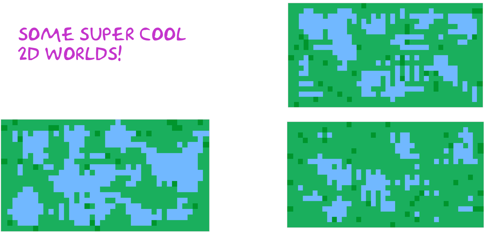

# mapz

procedurally generated 2D world made using javascript and cellular automaton.

## Getting Started

1. start up webpack (this also opens the built html file in your browser): ```npm start```

## Pix of mapz
